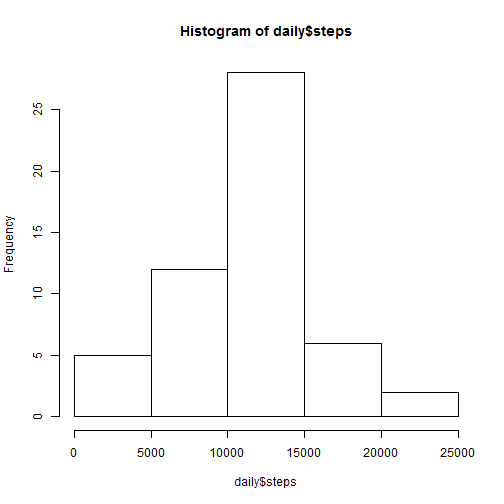
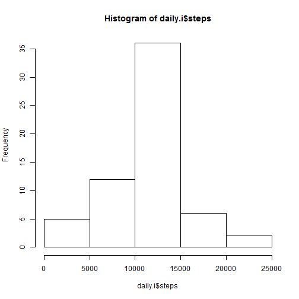

# Reproducible Research: Peer Assessment 1
by slashmatti


## Loading and preprocessing the data
Download the dataset [from this link](https://d396qusza40orc.cloudfront.net/repdata%2Fdata%2Factivity.zip) and unzip it into the working directory of R. The dataset is simply read into R with `read.csv("activity.csv")`. No further preprocessing is necessary at this point.


## What is mean total number of steps taken per day?
Using the dplyr package, the number of steps taken each day over dataset's period of 61 days is found and then plotted in a histogram with the following code.

```r
library(dplyr)
data <- read.csv("activity.csv")
daily <- data %>% group_by(date) %>% summarize(steps =sum(steps))
hist(daily$steps)
```

 

The mean is 1.0766189 &times; 10<sup>4</sup> and the median is 10765 of the total number of steps taken per day.


## What is the average daily activity pattern?
Again dplyr is used to find the daily activity pattern, and the interval identifier with on average most number of steps is found with `which.max()`. The daily average pattern of steps is plotted.

```r
pattern <- data %>% group_by(interval) %>% summarize(steps =mean(steps, na.rm=TRUE))
plot(pattern, type="l")
```

 

```r
pattern[which.max(pattern$steps), 1]
```

```
## Source: local data frame [1 x 1]
## 
##   interval
## 1      835
```

## Imputing missing values
Missing values are imputed with following code into a new column, that takes the daily average steps calculated previously in `pattern`.

```r
data.i <- mutate(data, fix.steps = ifelse(!is.na(steps), steps, pattern$steps))
daily.i <- data.i %>% group_by(date) %>% summarize(steps =sum(fix.steps))
hist(daily.i$steps)
```

 

With imputed data, the mean is 1.0766189 &times; 10<sup>4</sup> and the median is 1.0766189 &times; 10<sup>4</sup> of the total number of steps taken per day.

## Are there differences in activity patterns between weekdays and weekends?
